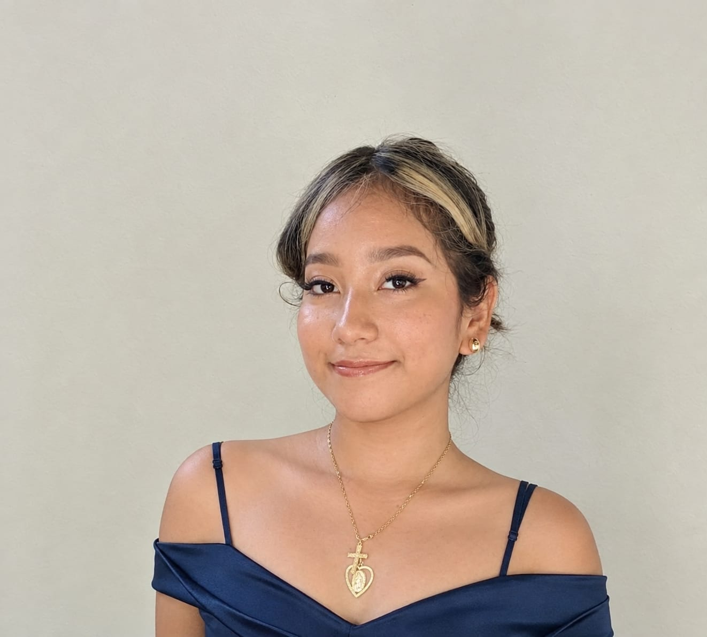

```{=html}
<section class="hero" aria-labelledby="presentacion">
  <div class="section-inner hero-grid">
    <div>
      <p class="eyebrow hero-label">ESTUDIANTE DE IT2iD</p>
      <p class="greeting">Hola, soy Alessandra</p>
      <h1 id="presentacion">Explorando el mundo de la <span>tecnología</span></h1>
      <p class="intro">Soy estudiante de Ingeniería en Tecnologías de la Información e Innovación Digital. Comparto mis aprendizajes, proyectos académicos e ideas sobre desarrollo web, bases de datos y diseño de interfaces.</p>
      <div class="actions"><a class="button primary" href="blog/index.qmd">Explorar artículos <span aria-hidden="true">→</span></a><a class="button secondary" href="#proyectos"><svg class="line-icon" viewBox="0 0 24 24" fill="none" stroke="currentColor" stroke-width="1.7" stroke-linecap="round" stroke-linejoin="round" aria-hidden="true"><rect x="3" y="5" width="18" height="15" rx="2"/><path d="M8 5V3h8v2M3 11h18"/></svg>Ver mis proyectos</a></div>
    </div>
    <figure class="hero-art"><figcaption>Un espacio para aprender y crear.</figcaption></figure>
  </div>
</section>

<section id="intereses" class="section soft" aria-labelledby="intereses-titulo">
  <div class="section-inner">
    <header class="center section-heading"><p class="eyebrow">ÁREAS DE INTERÉS</p><h2 id="intereses-titulo">Lo que estoy aprendiendo</h2><p>Comparto mis aprendizajes sobre bases de datos, diseño de interfaces y desarrollo web durante mi formación universitaria.</p></header>
    <div class="cards">
<article class="card interest"><div class="interest-body"><span class="icon"><svg class="line-icon" viewBox="0 0 24 24" width="24" height="24" fill="none" stroke="currentColor" stroke-width="1.7" stroke-linecap="round" stroke-linejoin="round" aria-hidden="true" focusable="false"><ellipse cx="12" cy="5" rx="8" ry="3"/><path d="M4 5v14c0 4 16 4 16 0V5M4 12c0 4 16 4 16 0"/></svg></span><h3>Bases de datos</h3><p>Diseño y organización de bases de datos relacionales, consultas SQL y administración de información con MySQL.</p></div><footer class="interest-footer"><span class="tag">SQL</span><span class="tag">MySQL</span></footer></article>
<article class="card interest"><div class="interest-body"><span class="icon"><svg class="line-icon" viewBox="0 0 24 24" width="24" height="24" fill="none" stroke="currentColor" stroke-width="1.7" stroke-linecap="round" stroke-linejoin="round" aria-hidden="true" focusable="false"><rect x="3" y="3" width="7" height="7" rx="1"/><rect x="14" y="3" width="7" height="7" rx="1"/><rect x="3" y="14" width="7" height="7" rx="1"/><rect x="14" y="14" width="7" height="7" rx="1"/></svg></span><h3>Diseño de interfaces</h3><p>Creación de interfaces claras y accesibles, elaboración de prototipos y diseño centrado en la experiencia del usuario.</p></div><footer class="interest-footer"><span class="tag">Figma</span><span class="tag">CSS</span></footer></article>
<article class="card interest"><div class="interest-body"><span class="icon"><svg class="line-icon" viewBox="0 0 24 24" width="24" height="24" fill="none" stroke="currentColor" stroke-width="1.7" stroke-linecap="round" stroke-linejoin="round" aria-hidden="true" focusable="false"><path d="m7 6-5 6 5 6m10-12 5 6-5 6M14 4l-4 16"/></svg></span><h3>Programación y desarrollo web</h3><p>Desarrollo de páginas y aplicaciones mediante estructura, estilos e interactividad, aplicando los conocimientos de mi formación.</p></div><footer class="interest-footer"><span class="tag">JavaScript</span><span class="tag">Python</span></footer></article>
    </div>
  </div>
</section>

<section id="proyectos" class="section" aria-labelledby="proyectos-titulo">
  <div class="section-inner">
    <header class="section-heading"><p class="eyebrow">PORTAFOLIO PRÁCTICO</p><h2 id="proyectos-titulo">Mis proyectos</h2><p>Proyectos académicos y prácticos desarrollados durante mi formación universitaria.</p></header>
```

::: {#proyectos-portada}
:::

```{=html}
    <p class="section-link"><a href="proyectos/index.qmd">Explorar el portafolio →</a></p>
  </div>
</section>

<section id="sobre-mi" class="section mint" aria-labelledby="sobre-titulo">
  <div class="section-inner about-card">
    <figure class="portrait"></figure>
    <div><p class="eyebrow">PERFIL PERSONAL</p><h2 id="sobre-titulo">Un poco sobre mí</h2><p>Soy Alessandra Beltrán, estudiante de Ingeniería en Tecnologías de la Información e Innovación Digital en la Universidad Politécnica de Chiapas. Me apasionan el desarrollo web, el diseño de interfaces y la creación de aplicaciones que resuelvan problemas reales. Disfruto aprender nuevas tecnologías, trabajar en equipo y seguir creciendo como desarrolladora Full Stack.</p>
      <div class="values"><div><h3><svg class="line-icon" viewBox="0 0 24 24" width="24" height="24" fill="none" stroke="currentColor" stroke-width="1.7" stroke-linecap="round" stroke-linejoin="round" aria-hidden="true" focusable="false"><path d="M8 17c0-3-3-4-3-8a7 7 0 0 1 14 0c0 4-3 5-3 8M8 17h8M9 20h6M10 23h4"/></svg><span>Curiosidad</span></h3><p>Aprendizaje diario y exploración de nuevas tecnologías.</p></div><div><h3><svg class="line-icon" viewBox="0 0 24 24" width="24" height="24" fill="none" stroke="currentColor" stroke-width="1.7" stroke-linecap="round" stroke-linejoin="round" aria-hidden="true" focusable="false"><circle cx="9" cy="7" r="3"/><path d="M2 20v-3a7 7 0 0 1 14 0v3M17 4a3 3 0 0 1 0 6M18 13c3 0 4 2 4 4v3"/></svg><span>Colaboración</span></h3><p>Trabajo en equipo, respeto y apoyo mutuo.</p></div><div><h3><svg class="line-icon" viewBox="0 0 24 24" width="24" height="24" fill="none" stroke="currentColor" stroke-width="1.7" stroke-linecap="round" stroke-linejoin="round" aria-hidden="true" focusable="false"><path d="m7 6-5 6 5 6m10-12 5 6-5 6M14 4l-4 16"/></svg><span>Código limpio</span></h3><p>Código claro, organizado y fácil de mantener.</p></div></div>
    </div>
  </div>
</section>
```

::: {.section .recent-section}
::: {.section-inner}
```{=html}
<header class="section-heading recent-heading"><div><p class="eyebrow">BITÁCORA TÉCNICA</p><h2 id="articulos-recientes">Artículos recientes</h2></div><a class="button secondary" href="blog/index.qmd">Ver todo el blog</a></header>
```

::: {#recientes}
:::
:::
:::

```{=html}
<section id="contacto" class="section soft" aria-labelledby="contacto-titulo">
  <div class="contact-card center"><p class="eyebrow">IDEAS QUE NOS CONECTAN</p><h2 id="contacto-titulo">¡Conectemos!</h2><p>¿Tienes alguna duda sobre mis proyectos o te gustaría compartir ideas? Me encantará conversar contigo.</p><ul class="contact-options"><li><a class="button primary" href="mailto:253392@it2id.upchiapas.edu.mx"><svg class="line-icon" viewBox="0 0 24 24" width="24" height="24" fill="none" stroke="currentColor" stroke-width="1.7" stroke-linecap="round" stroke-linejoin="round" aria-hidden="true" focusable="false"><rect x="2" y="4" width="20" height="16" rx="2"/><path d="m2 6 10 7L22 6"/></svg>Correo</a></li><li><a class="button secondary" href="https://github.com/Alekiwuichip23"><svg class="line-icon" viewBox="0 0 24 24" width="24" height="24" fill="none" stroke="currentColor" stroke-width="1.7" stroke-linecap="round" stroke-linejoin="round" aria-hidden="true" focusable="false"><path d="M9 20c-4 1-4-2-6-2m15 4v-4c0-1-.3-2-1-2 4-.5 6-2 6-6 0-2-.5-3-2-4 .5-1 .5-3 0-4-2 0-3 1-4 2-2-.5-4-.5-6 0-1-1-2-2-4-2-.5 1-.5 3 0 4-1.5 1-2 2-2 4 0 4 2 5.5 6 6-.7.5-1 1-1 2v4" transform="translate(-1 0)"/></svg>GitHub</a></li><li><a class="button secondary" href="https://www.linkedin.com/in/alessandra-de-los-santos-403b32436/"><svg class="line-icon" viewBox="0 0 24 24" width="24" height="24" fill="none" stroke="currentColor" stroke-width="1.7" stroke-linecap="round" stroke-linejoin="round" aria-hidden="true" focusable="false"><rect x="2" y="2" width="20" height="20" rx="3"/><path d="M7 10v7M7 7h.01M11 17v-7m0 3a3 3 0 0 1 6 0v4"/></svg>LinkedIn</a></li></ul></div>
</section>
```
