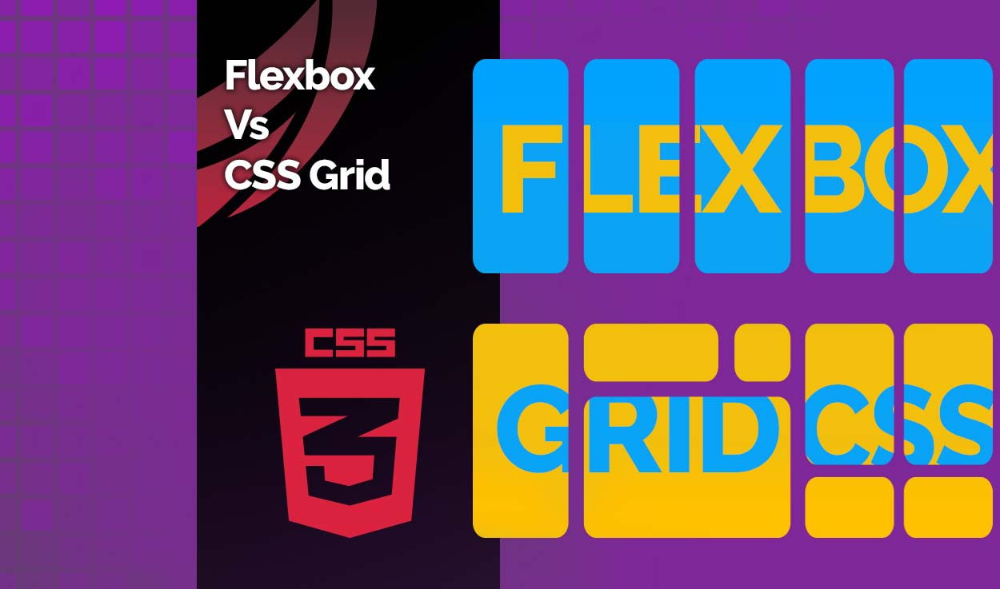

{.article-cover fig-alt="Comparación visual de Flexbox y CSS Grid con bloques alineados"}

Alinear varias tarjetas parece sencillo hasta que sus textos tienen longitudes diferentes o la pantalla se vuelve estrecha. Flexbox ofrece una manera de repartir espacio y alinear elementos sin calcular manualmente cada posición. Resulta especialmente útil para menús, grupos de botones y filas de contenido que deben adaptarse.

## Contenedor y elementos flexibles

Flexbox organiza los hijos directos de un contenedor. Al aplicar `display: flex`, ese contenedor controla cómo se distribuyen sus elementos. El texto y los enlaces dentro de una tarjeta no se convierten automáticamente en elementos flexibles de la fila: pertenecen a otro nivel de la estructura.

Puedes imaginar una caja que organiza varias tarjetas. La caja decide la dirección, los espacios y la alineación; cada tarjeta conserva su contenido. Esta distinción permite elegir dónde colocar una propiedad cuando no produce el efecto esperado.

## Dos ejes para entender la alineación

El **eje principal** sigue la dirección establecida por `flex-direction`. Con `row`, los elementos se colocan en fila; con `column`, se apilan. El **eje transversal** es perpendicular al principal.

`justify-content` distribuye el espacio disponible sobre el eje principal. `center` reúne los elementos en el centro; `space-between` coloca espacio entre ellos. Si los elementos ya ocupan todo el ancho, apenas queda espacio que repartir y el cambio puede no ser visible.

`align-items` controla la alineación transversal. `center` centra los elementos en ese eje; `stretch` permite que se estiren, cuando su tamaño transversal es automático. Por eso cambiar de `row` a `column` también cambia el significado visual de ambas propiedades.

## Un ejemplo completo de tres tarjetas

Crea una carpeta con `index.html` y `styles.css`. Guarda este documento en `index.html`; el enlace del encabezado cargará los estilos del segundo archivo:

```html
<!doctype html>
<html lang="es">
<head>
  <meta charset="utf-8">
  <meta name="viewport" content="width=device-width, initial-scale=1">
  <title>Tarjetas con Flexbox</title>
  <link rel="stylesheet" href="styles.css">
</head>
<body>
  <main>
    <h1>Áreas para explorar</h1>
    <div class="tarjetas">
      <article class="tarjeta">
        <h2>Bases de datos</h2>
        <p>Organizar información en tablas relacionadas.</p>
      </article>
      <article class="tarjeta">
        <h2>Interfaces</h2>
        <p>Crear pantallas comprensibles y accesibles.</p>
      </article>
      <article class="tarjeta">
        <h2>Desarrollo web</h2>
        <p>Combinar estructura, estilos e interacciones.</p>
      </article>
    </div>
  </main>
</body>
</html>
```

Guarda estas reglas en `styles.css` y abre el HTML en el navegador:

```css
* { box-sizing: border-box; }
body {
  margin: 0;
  font-family: system-ui, sans-serif;
  line-height: 1.6;
  color: #243831;
  background: #edf8f2;
}
main { max-width: 1100px; margin: auto; padding: 24px; }
.tarjetas {
  display: flex;
  flex-direction: row;
  justify-content: center;
  align-items: stretch;
  flex-wrap: wrap;
  gap: 24px;
}
.tarjeta {
  flex: 1 1 250px;
  min-width: 0;
  padding: 24px;
  background: white;
  border-radius: 14px;
  overflow-wrap: anywhere;
}
.tarjeta h2 { color: #006b57; }
@media (max-width: 600px) {
  .tarjetas { flex-direction: column; }
  .tarjeta { flex-basis: auto; }
}
```

En una pantalla amplia verás tres tarjetas en fila, con espacios iguales. Al reducir el ancho, podrán pasar a nuevas líneas. En teléfono, la regla de medios las apila sin obligarlas a conservar un ancho rígido.

## Espacios y adaptación

`gap: 24px` establece separación entre elementos y líneas. Es más fácil de mantener que añadir márgenes a cada tarjeta y corregir después el primero o el último.

`flex-wrap: wrap` permite nuevas líneas cuando los elementos ya no caben. Sin esta propiedad, Flexbox intenta mantenerlos en una sola línea, reduciéndolos según sus reglas. Los contenidos muy largos pueden dificultar esa reducción.

En `flex: 1 1 250px`, el primer valor permite crecer, el segundo permite reducirse y el tercero indica una base inicial. No equivale a imponer siempre 250 píxeles de ancho. `min-width: 0` ayuda a que el contenido pueda ajustarse; `box-sizing` incluye el padding en el cálculo del tamaño.

Al pasar a columna, `flex-basis` actúa sobre el eje vertical. Restablecerlo a `auto` evita que cada tarjeta reserve una altura inicial de 250 píxeles. Así conserva la altura que requiere su contenido.

## Flexbox y Grid

Flexbox trabaja principalmente en una dimensión: una fila o una columna. Aunque permita envolver elementos, cada línea distribuye su espacio de manera independiente. Grid resulta más adecuado cuando necesitas coordinar filas y columnas de una cuadrícula completa.

Una barra de navegación puede resolverse con Flexbox; un listado que exige columnas alineadas en varias filas puede beneficiarse de Grid. Elegir depende de cómo deben relacionarse los elementos, no de utilizar siempre la misma herramienta.

## Errores frecuentes

Aplicar `justify-content` a una tarjeta en lugar de al contenedor no organiza sus tarjetas hermanas. Otro error es fijar anchos grandes y olvidar el espacio de `gap`, el padding o el contenido. Prueba también títulos largos, no solo textos cortos que caben fácilmente.

Evita usar `order` únicamente para cambiar la lectura visual: el orden del documento sigue siendo importante para teclado y tecnologías de asistencia. Mantén una estructura comprensible desde el HTML.

## Actividad y cierre

Agrega una cuarta tarjeta y observa cómo se reparte cada línea. Después prueba `align-items: center` y explica por qué las alturas dejan de estirarse igual. Revisa el diseño a 375 píxeles sin desplazamiento horizontal.

Entender los ejes y el papel del contenedor facilita predecir el resultado. Cambia una propiedad cada vez y relaciona el efecto visual con la regla que lo produjo.

```{=html}
<a class="back-to-blog" href="../../blog/index.qmd"><span aria-hidden="true">←</span> Volver al blog</a>
```
