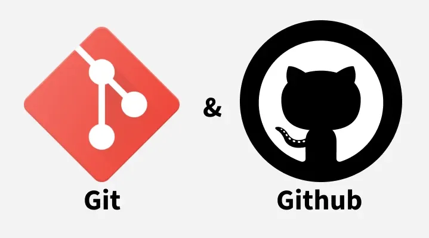

{.article-cover fig-alt="Logotipos de Git y GitHub sobre un fondo claro"}

Guardar versiones como `pagina-final`, `pagina-final2` y `pagina-final-ahora-si` complica reconocer qué cambió. Un sistema de control de versiones registra el historial de un proyecto y permite consultar sus etapas. Git ofrece esa organización; GitHub permite alojar repositorios y compartirlos, pero son herramientas diferentes.

## Git y GitHub no son lo mismo

**Git** funciona en tu computadora y administra versiones dentro de un repositorio. Puedes registrar cambios sin conexión a internet. **GitHub** es una plataforma que aloja repositorios remotos y facilita compartir su historial con otras personas.

Un proyecto puede utilizar Git sin publicarse en GitHub. También puedes tener archivos en GitHub sin que los cambios nuevos de tu computadora se hayan enviado todavía. Distinguir ambos espacios evita pensar que guardar un archivo actualiza automáticamente el repositorio remoto.

## Repositorio, preparación y commit

Un **repositorio** reúne los archivos y el historial que Git administra. El directorio de trabajo contiene lo que estás editando. El área de preparación selecciona los cambios que quieres incluir en el siguiente registro.

Un **commit** registra una versión preparada, acompañada de un mensaje que explica el cambio. No representa necesariamente todo lo que modificaste: incluye lo que seleccionaste para ese commit. Un **remoto** es una referencia a otro repositorio, normalmente accesible mediante una dirección.

## Una carpeta de práctica independiente

Los comandos siguientes son un ejercicio para una carpeta nueva; no los ejecutes sin revisar la ubicación actual. Utiliza una terminal dentro de `practica-git`, separada de tus proyectos existentes. Antes de comenzar, Git debe estar instalado y tu nombre y correo de autor configurados según las indicaciones de su instalación.

```bash
git init
git status
```

`git init` crea el repositorio de esa carpeta. `git status` informa qué archivos cambiaron, cuáles están preparados y cuáles todavía no se siguen. Consultar el estado antes y después de cada paso ayuda a comprender lo que estás registrando.

## Elegir archivos y registrar una versión

Crea `index.html` con una presentación sencilla y `styles.css` con algunos estilos. Prepara esos archivos de forma explícita:

```bash
git add index.html styles.css
git status
git commit -m "Agregar presentación y estilos iniciales"
```

`git add` lleva sus cambios al área de preparación. `git commit` registra esa selección en el historial local. Si editas un archivo después de prepararlo, su nueva modificación no se incorpora automáticamente al commit: debes revisar el estado y prepararla cuando corresponda.

Un mensaje claro describe una acción concreta. “Ajustar espacios del formulario” explica más que “Cambios”. Procura agrupar modificaciones relacionadas para que cada registro tenga un propósito fácil de comprender.

## La función de .gitignore

El archivo `.gitignore` indica patrones de archivos que Git no debe incorporar como nuevos archivos seguidos. Puede excluir cachés, archivos temporales y configuraciones locales. Un ejemplo para la carpeta de práctica es:

```gitignore
.env
*.log
```

Guarda esas líneas en `.gitignore` y registra también ese archivo con `git add .gitignore` y un commit descriptivo. Ignorar `.env` ayuda a evitar incorporarlo accidentalmente, pero no sustituye revisar qué estás preparando.

**No subas contraseñas, tokens ni claves.** `.gitignore` no elimina del historial información que ya fue registrada. Si una credencial se expone, debes revocarla o reemplazarla y revisar el incidente; añadir su nombre a la lista de exclusión no corrige la exposición anterior.

## Conectar un remoto y enviar cambios

Crea en GitHub un repositorio vacío para el ejercicio y utiliza su dirección real. **La URL siguiente es un valor de ejemplo que debes reemplazar**, no un repositorio existente recomendado para enviar archivos:

```bash
git remote add origin https://github.com/TU_USUARIO/TU_REPOSITORIO.git
git remote -v
git branch --show-current
```

`origin` es un nombre convencional para el remoto. `git remote -v` permite comprobar su dirección; el último comando muestra tu rama actual. Para enviar los commits utiliza el nombre que realmente tenga esa rama:

```bash
git push -u origin NOMBRE_DE_TU_RAMA
```

Reemplaza también `NOMBRE_DE_TU_RAMA`. `push` envía commits al remoto y puede solicitar autenticación. Si el envío falla, lee el mensaje y comprueba permisos, conexión y estado del remoto; no fuerces el envío para saltarte el problema.

## Tres acciones diferentes

**Guardar** actualiza un archivo en la computadora. **Hacer commit** registra una selección en el historial local. **Subir con push** comparte los commits con el remoto. Un archivo guardado pero no registrado no viaja como parte de un commit por ejecutar `push`.

## Actividad y cierre

En una carpeta independiente, crea una página, consulta su estado y registra una primera versión. Cambia solamente el título, revisa qué detecta Git y registra otro commit con un mensaje concreto. Identifica qué pasos fueron locales y cuál necesitaría conexión.

El hábito más útil es revisar antes de registrar y antes de compartir. Un historial comprensible facilita continuar el trabajo sin depender de nombres de archivos cada vez más largos.

```{=html}
<a class="back-to-blog" href="../../blog/index.qmd"><span aria-hidden="true">←</span> Volver al blog</a>
```
