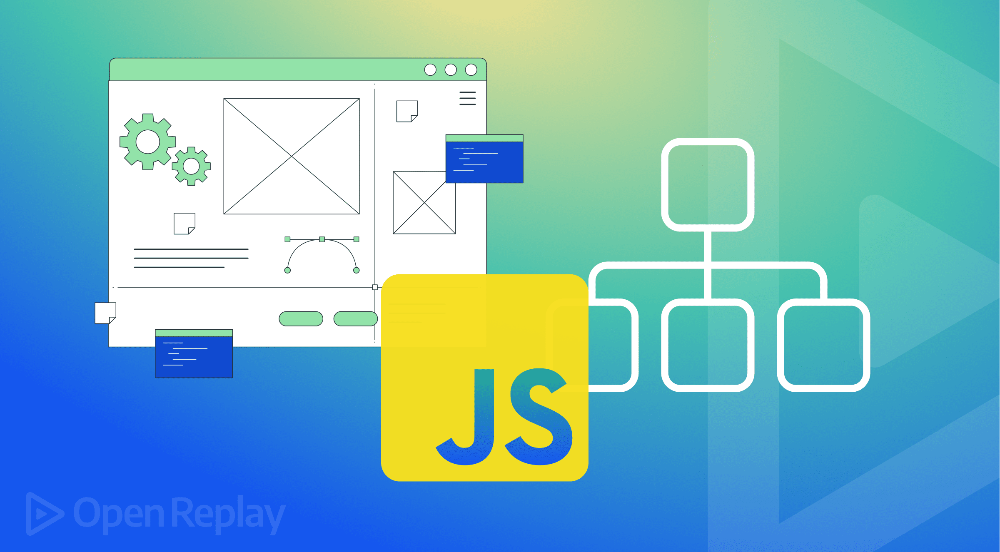

{.article-cover fig-alt="Símbolo de JavaScript junto a una interfaz web y un árbol de elementos"}

Una página puede responder a un clic sin cargar otro documento. Para conseguirlo, JavaScript necesita localizar los elementos y definir qué cambia cuando ocurre una acción. Un botón que muestra u oculta un mensaje es un buen primer ejercicio: reúne selección, eventos, texto y clases en una interacción fácil de comprobar.

## Qué representa el DOM

El **DOM**, o modelo de objetos del documento, es la representación que el navegador construye a partir del HTML. Sus elementos forman una estructura relacionada: un encabezado pertenece a una sección, un botón contiene texto y un párrafo puede tener atributos.

JavaScript trabaja con esa representación. Cambiar el DOM actualiza lo que vemos en la página, pero no reescribe automáticamente el archivo HTML guardado en la computadora. Al recargar, el navegador vuelve a interpretar el archivo y ejecutar los scripts que correspondan.

## Preparar los archivos

Crea `index.html`, `styles.css` y `script.js` dentro de una misma carpeta. Guarda en el primero este documento completo. Los identificadores `alternar` y `mensaje` permiten localizar los dos elementos que participan en la interacción.

```html
<!doctype html>
<html lang="es">
<head>
  <meta charset="utf-8">
  <meta name="viewport" content="width=device-width, initial-scale=1">
  <title>Un mensaje interactivo</title>
  <link rel="stylesheet" href="styles.css">
  <script src="script.js" defer></script>
</head>
<body>
<main>
  <h1>Explora una interacción</h1>
  <button id="alternar" type="button"
    aria-controls="mensaje" aria-expanded="false">Mostrar mensaje</button>
  <p id="mensaje" class="mensaje oculto">Un pequeño cambio puede ayudarte a aprender.</p>
</main>
</body>
</html>
```

`defer` permite ejecutar este script externo después de interpretar el HTML. Así, el botón y el párrafo ya existen cuando el código intenta encontrarlos. Si cambias el nombre del archivo, actualiza también el atributo `src`.

## La presentación y el estado oculto

Guarda estas reglas en `styles.css`. La clase `oculto` representa un estado de la interfaz, no una modificación del contenido del archivo.

```css
body {
  margin: 0;
  font-family: system-ui, sans-serif;
  line-height: 1.6;
  background: #edf8f2;
  color: #243831;
}
main { max-width: 720px; margin: auto; padding: 24px; }
button {
  padding: 12px 20px;
  border: 0;
  border-radius: 8px;
  background: #006b57;
  color: white;
  font: inherit;
  cursor: pointer;
}
button:focus-visible { outline: 3px solid #006b57; outline-offset: 4px; }
.mensaje { padding: 20px; background: white; border-radius: 12px; }
.oculto { display: none; }
```

El mensaje comienza oculto y el botón sigue disponible. Al quitar esa clase, el párrafo vuelve a participar en la presentación. Utilizar `display: none` también retira el mensaje del árbol de accesibilidad mientras permanece oculto.

## Selección y eventos

Guarda el siguiente código en `script.js`:

```javascript
const boton = document.querySelector("#alternar");
const mensaje = document.querySelector("#mensaje");

boton.addEventListener("click", () => {
  const estaOculto = mensaje.classList.toggle("oculto");
  boton.textContent = estaOculto ? "Mostrar mensaje" : "Ocultar mensaje";
  boton.setAttribute("aria-expanded", String(!estaOculto));
});
```

`querySelector` busca el primer elemento que coincide con un selector CSS. El símbolo `#` indica un identificador. Si no encuentra coincidencia, devuelve `null`; por eso los nombres deben corresponder exactamente al HTML y no repetirse entre elementos.

`addEventListener` registra una función que se ejecutará cuando ocurra un evento. En este caso escucha `click`. Un botón nativo también permite activar esa acción con teclado, sin convertir un elemento decorativo en un control improvisado.

## Texto, clases y estado accesible

`classList.toggle("oculto")` añade la clase si falta o la elimina si existe. Su resultado indica si la clase queda presente después del cambio. La variable `estaOculto` utiliza ese resultado para decidir qué texto mostrar en el botón.

`textContent` modifica el contenido textual. Es apropiado para mensajes que no necesitan etiquetas HTML y evita interpretar el texto como marcado. No insertes datos del usuario mediante `innerHTML` para resolver esta interacción.

`aria-expanded` informa si el contenido asociado está desplegado. Su valor se actualiza junto con la clase y el texto: el estado anunciado debe coincidir con el visible. `aria-controls` identifica el elemento relacionado mediante su `id`.

## Código fuente frente a cambios visibles

Abre las herramientas del navegador y examina el párrafo mientras pulsas el botón. Verás cambiar su clase, pero el archivo `index.html` seguirá conteniendo `oculto`. Este contraste ayuda a distinguir el documento original de su estado actual en el DOM.

El ejemplo no guarda preferencias ni conserva el estado entre recargas. Al abrir nuevamente la página, el mensaje vuelve a estar oculto. No atribuyas persistencia a una interacción que únicamente modifica elementos en memoria.

## Errores frecuentes

Un identificador mal escrito puede provocar un error al intentar usar un elemento inexistente. Revisa también las rutas, el uso de `defer` y los mensajes de la consola. Otro problema es actualizar la clase y olvidar el texto o el estado accesible del botón.

Mantén el comportamiento en el script y la apariencia en CSS. Así puedes cambiar colores o espacios sin alterar la función que escucha el evento.

## Actividad y cierre

Añade un segundo conjunto de botón y mensaje con identificadores distintos. Comprueba que cada botón controla únicamente su párrafo y que Tab, Enter y Espacio permiten utilizarlos. Después recarga para observar el estado inicial.

Comprender el DOM permite construir interacciones pequeñas y predecibles. El objetivo es mantener coherentes el documento, la acción y la respuesta que recibe la persona.

```{=html}
<a class="back-to-blog" href="../../blog/index.qmd"><span aria-hidden="true">←</span> Volver al blog</a>
```
