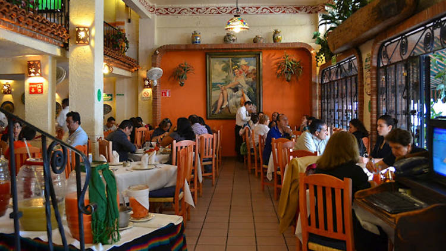

```{=html}
<header class="project-intro">
  <div><p class="eyebrow">Gestión de fondas</p><h1>Sistema de Gestión Web de Fonda PuraVida</h1><p>Un MVP orientado a apoyar las tareas cotidianas de una fonda local y ofrecer información útil a sus clientes.</p></div>
  
</header>
```

::: {.project-copy}
## Problemática que aborda

Cuando el menú, los pedidos y las ventas se registran manualmente, la información puede quedar dispersa. Consultar qué platillos hay disponibles o reconstruir las ventas de una semana exige revisar distintas anotaciones. Para los clientes, también puede ser difícil saber qué ofrece la fonda ese día o si está abierta antes de acercarse al establecimiento.

El proyecto plantea reunir esa información en una interfaz web. Su alcance corresponde a un **MVP**, es decir, una primera versión centrada en las funciones esenciales. Esta descripción delimita lo que se busca resolver y no implica que todos los componentes estén terminados.

## Objetivo

Apoyar la operación diaria de Fonda PuraVida mediante una consulta pública del menú y herramientas diferenciadas para clientes y encargada. La intención es organizar pedidos y registros de venta sin trasladar los pagos a internet ni ampliar el sistema a la gestión de inventario.

## Funcionalidades previstas

- **Consulta pública:** mostrar el menú del día y el estado abierto o cerrado de la fonda, sin exigir una cuenta para consultar esa información.
- **Perfil de cliente:** permitir el registro, el inicio de sesión y la realización de pedidos por clientes autenticados.
- **Gestión de pedidos:** dejar a la encargada la aceptación o el rechazo manual de cada pedido. Enviar una solicitud no equivale a que haya sido aceptada.
- **Administración del menú:** organizar los platillos y la información del menú desde el perfil de encargada.
- **Ventas presenciales:** registrar manualmente las ventas efectuadas en el establecimiento para incorporarlas al seguimiento de la operación.
- **Consulta de información:** presentar estadísticas y reportes semanales en PDF como apoyo para revisar los registros disponibles.

Los perfiles de cliente y encargada separan responsabilidades: consultar y solicitar pedidos es distinto de administrar platillos o registrar ventas. El alcance mantiene **pagos presenciales**, sin pagos en línea, y **no incluye inventario**.

## Tecnologías

**HTML, CSS y JavaScript** corresponden a la interfaz. HTML estructura menús y formularios; CSS organiza la presentación y su adaptación a diferentes pantallas; JavaScript permite manejar interacciones y estados visibles.

Estas tecnologías no describen por sí solas cómo se implementan la autenticación o el almacenamiento. No se atribuyen herramientas adicionales porque los archivos actuales no documentan otras tecnologías del proyecto.

## Aprendizajes y aspectos para practicar

El alcance permite practicar formularios comprensibles, navegación por perfiles y representación clara de estados como abierto, cerrado, aceptado o rechazado. También invita a distinguir un pedido solicitado de una venta registrada y a organizar información útil para los reportes.

Una revisión de la interfaz puede comprobar si el menú se encuentra fácilmente, si cada perfil reconoce sus acciones y si los mensajes explican lo que sucede. Estos criterios ayudan a evaluar el MVP sin afirmar resultados medidos ni una implementación completa.

:::

```{=html}
<nav class="project-return" aria-label="Volver al portafolio">
  <a class="project-return-button primary" href="index.qmd"><span aria-hidden="true">←</span> Volver a los proyectos</a>
  <a class="project-return-button secondary" href="../index.qmd"><svg class="line-icon" viewBox="0 0 24 24" fill="none" stroke="currentColor" stroke-width="1.7" stroke-linecap="round" stroke-linejoin="round" aria-hidden="true"><path d="m3 10 9-7 9 7M5 9v12h14V9M9 21v-8h6v8"/></svg> Ir al inicio</a>
</nav>
```
